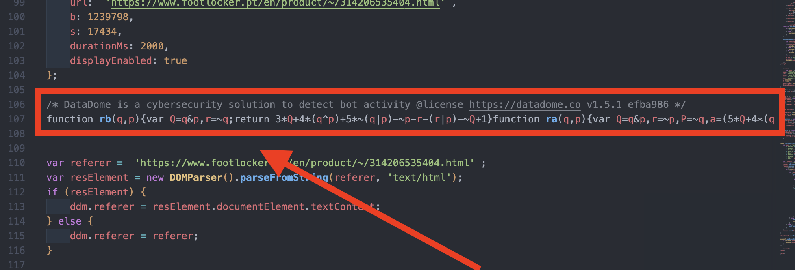
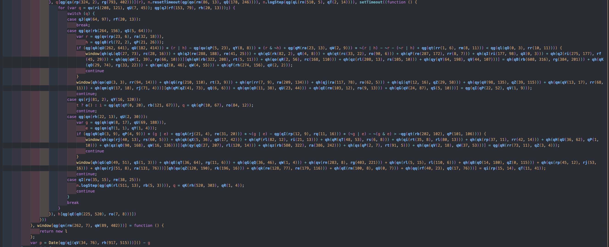
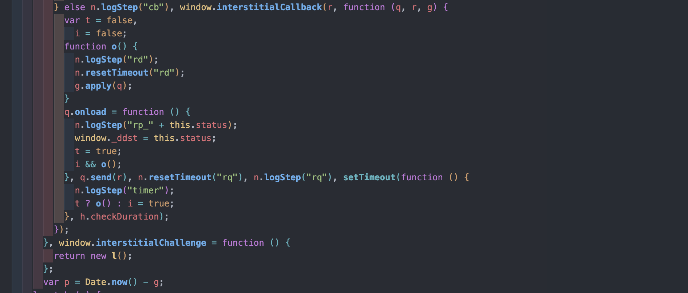

# Datadome Interstitial Deobfuscator

This project, is designed to decode and simplify JavaScript files obfuscated by Datadome's new Interstitial challenge. The original script, typically obfuscated, can be transformed into a more readable and maintainable format.


The original script can be found as one line minimized code in the HTML file of the Interstitial challenge.

## Table of Contents
- [Datadome Interstitial Deobfuscator](#datadome-interstitial-deobfuscator)
  - [Table of Contents](#table-of-contents)
  - [Features](#features)
  - [Prerequisites](#prerequisites)
  - [Usage](#usage)
  - [Structure](#structure)
  - [Before and After Comparison](#before-and-after-comparison)
  - [Contributing](#contributing)
  - [License](#license)
  - [Contact](#contact)

## Features
- Specifically targets the obfuscation patterns used in Datadome's Interstitial challenge.
- Efficiently decodes hexadecimal encoded strings within the JavaScript file.
- Transforms and simplifies initial function calls and variables for enhanced readability.
- Eliminates dead code, including unused functions and variables.
- Improves overall code clarity, making it easier to understand and maintain.

## Prerequisites
- Node.js
- Required Babel libraries: `@babel/parser`, `@babel/traverse`, `@babel/generator`, `@babel/core`, `@babel/types`

## Usage
Execute the deobfuscator using the following command:
```bash
node main.js <input> [output]
```
- `<input>`: Path to the input JavaScript file (obfuscated by Datadome's Interstitial challenge).
- `[output]`: (Optional) Path for saving the deobfuscated code. Defaults to `out.js` if not specified.

## Structure
The project structure is as follows:
```
.
├── README.md
├── index.html
├── main.js
├── package-lock.json
├── package.json
└── transformers
    ├── cleanCode.js
    └── evaluateStringObf.js
```

- `main.js`: The main script that orchestrates the deobfuscation process.
- `transformers/`: Contains scripts for specific transformations.
    - `evaluateStringObf.js`: Handles the deobfuscation of the file.
    - `cleanCode.js`: Improves the readability of the code post-deobfuscation.

## Before and After Comparison
A screenshot demonstrating the original obfuscated script and its deobfuscated version will be attached to visually highlight the effectiveness of this tool. (just a snippet of the code)
- Original obfuscated script:
  
- Deobfuscated script:
  

## Contributing
Contributions to enhance or extend the functionality of this tool are welcome. Please feel free to submit pull requests. For significant changes or suggestions, kindly open an issue to discuss your ideas.

## License
This project is made available under the MIT [License](LICENSE). For more information, refer to the LICENSE file.

## Contact
- [Website](https://glizzykingdreko.github.io)
- [GitHub](https://github.com/glizzykingdreko)
- [Twitter](https://mobile.twitter.com/glizzykingdreko)
- [Medium](https://medium.com/@glizzykingdreko)
- [Email](mailto:glizzykingdreko@protonmail.com)
